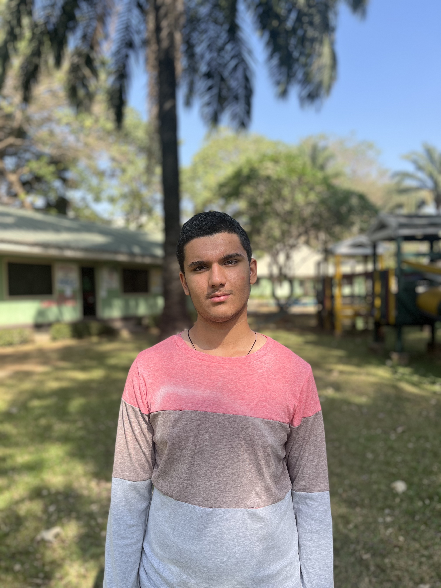

---
title: "Areetam Linus-Okorie"
output:
  html_document:
    toc: true
    toc_float: true
--- 



```{r, include=FALSE}
#This is my first website. 

#This page is going to be your home page... In this section, give a catchy summary about yourself... if a college or university read this page, what are the things you would like them to know about you if they are trying to decide if they would offer you a place in their college or university or if they would offer you a scholarship. 

#Include things like the name of the school you are currently attending... your resume if you have one, outstanding projects you have done and what your interests are. In essence, sell yourself to the school! 

```

 
### About Me:

Hi, I'm Areetam Linus-Okorie, and I'm in 8th grade at [International Community School(ICS)](https://icsabuja.com/). I’m excited about learning new things and exploring my interests in school and outside of school. I’m always looking for ways to grow, whether that’s through my schoolwork, hobbies, or helping others.

### School & Academics:

##### Favorite Subjects:

I really enjoy math and history, I enjoy math because of the numbers, what makes it fun is crunching down big numbers and using different techniques to solve different advanced question.I enjoy history because learning what happened in the past can really impact what you think of today's society, it can also teach you why some things are what they are and the events leading up to that moment.

#### Achievements:

I’ve been on the honor roll for 2 years in a row and I’m always trying my best in class. Some of my favorite school moments have been getting an award during an award ceremony,getting the most points on a school science fair, and making a massive improvement in a subject I was not so strong in.
 
### Activities & Interests:

##### Clubs & Teams:

I’m involved in an A.I robotics club. I enjoy being part of the club and helping to make things happen.

### Hobbies: 

Outside of school, I like to play football. I’m always eager to learn something new or practice skills I enjoy.

### What I Want to Do:

In the future, I want to become a successful CEO and business man, I would also want to be a professional footballer. I’m excited to keep learning and discover new things that would help me reach my dreams.

### Why I Love Learning:

I’m always curious about the world around me and love discovering new ideas. Whether it’s through school projects, books, or talking to people, I enjoy finding out more and figuring things out. I can’t wait to keep learning and growing in high school and beyond!

